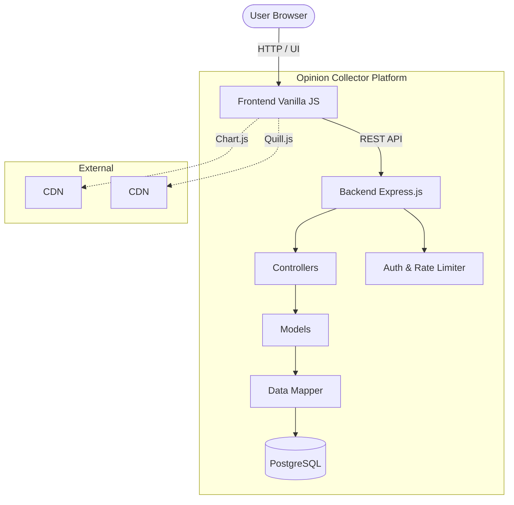
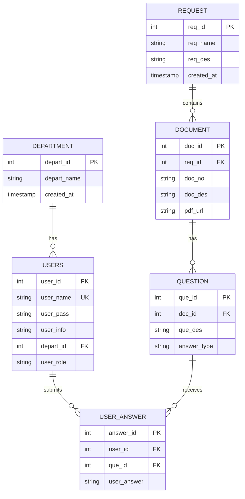
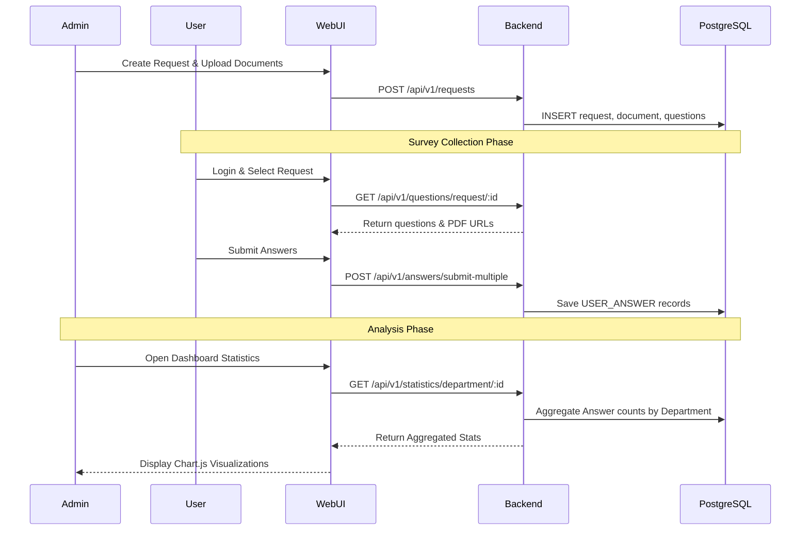

<div align="center">
  <h1>Opinion Collector System</h1>
  <p><b>A professional, dynamic, and robust survey and opinion collection platform.</b></p>
  
  [](#)
  [](#)
  [](#)
  [](#)
  [](#)
</div>

---

## Overview

The **Opinion Collector System** is an advanced platform designed to configure, collect, and analyze user feedback across multiple departments dynamically.

### Core Objectives
- Flexible management of organizational departments and users via a unified Dashboard UI.
- Concurrent opinion collection across multiple document-based surveys.
- **Real-time Analytics:** Collection and visualization of voting metrics and feedback.
- **Workflow Automation:** Seamless transitioning from document ingestion to automated reporting and KPI calculation.

---

## Key Features

| Feature | Description |
| :--- | :--- |
| **Department Management** | Logical grouping of users across various administrative departments for accurate polling. |
| **Survey & Document Control** | Full CRUD for dynamic surveys and referencing multiple PDF/Text documents per request. |
| **Dynamic Questionnaires**| Support for defining multiple questions (Boolean Yes/No, or Text) per document. |
| **Rich Text Integration** | Integrated Quill.js editor for rich text formatting of surveys and announcements. |
| **Built-in Visualization**| Interactive Chart.js integration embedded directly within the dashboard for real-time statistics. |
| **Role-based Access** | Distinct portals for System Administrators (management) and standard Users (answering surveys). |
| **Data Mapping** | Automated `camelCase` to `snake_case` mapping ensuring consistent Backend to Frontend workflows. |

---

## Core Entities

| Entity | Description |
| :--- | :--- |
| **Users** | System participants categorized by roles (ADMIN, USER) and assigned to Departments. |
| **Departments** | Organizational units used to segment and analyze survey results. |
| **Requests** | The overarching survey/campaign linking multiple documents together. |
| **Documents** | The core material (PDF/Content) that users review before answering questions. |
| **Questions** | Specific inquiries attached to documents (e.g., Do you agree with this policy?). |
| **Answers** | User-submitted feedback mapped to specific questions. |

---

## System Architecture



---

## Database Design



---

## Benchmark Execution Flow



---

## Getting Started

### 1. Prerequisites
- **Node.js 18+**
- **PostgreSQL 15+**

### 2. Installation
```bash
# Clone the repository
git clone https://github.com/MrPhuocTan/opinion-collector.git
cd opinion-collector

# Install backend dependencies
cd backend
npm install

# Setup Database
# Execute the SQL scripts in the `db/` folder into your PostgreSQL instance.
```

### 3. Running the Platform
```bash
# Start backend server (Port 3000)
cd backend
npm run dev

# Start frontend (use VSCode Live Server or a simple HTTP server on Port 9090)
cd ../frontend
npx serve . -p 9090
```
*The Web UI will be accessible at `http://localhost:9090/pages/login.html`*

---

## Support & Contact
For platform inquiries, infrastructure support, or architectural discussions, contact the engineering team.

**Author & Credits:**
MrPhuocTan - phtan.working@gmail.com - 097.201.2901

*Opinion Collector System - © 2026 MrPhuocTan. All rights reserved.*
